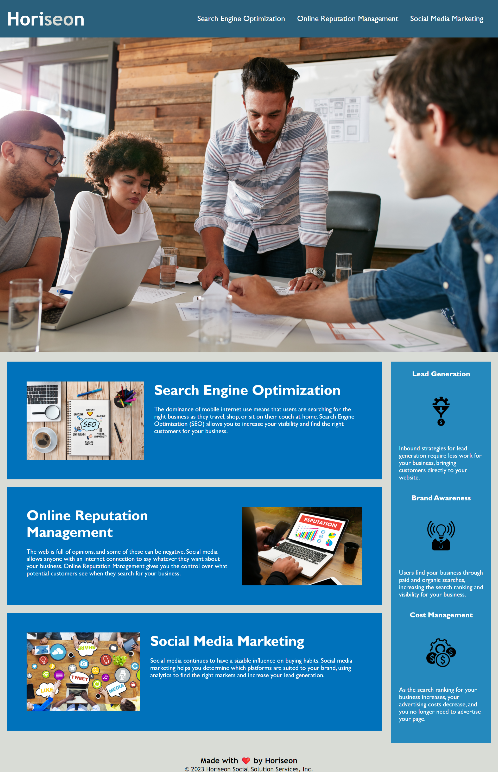

# Code Refactor

## Description

Our first homework challenge was meant to simulate a company that hired me to refactor their website for accessibility purposes. The changes will allow screenreaders to better communicate to the client the contents of the webpage. By adding semantic HTML and comments, the site's purpose is much more concise.

## Usage

Visit this URL: https://seeyouthursday.github.io/C1codeRefactor/

To navigate this website, simply select from the navbar which topic you would like to know information about. For example, when you select "Search Engine Optimization", you will be taken to the Search Engine Optimization description. This website contains the types of work Horiseon does for their clients.

## Credits

N/A

## License

---

🏆 The previous sections are the bare minimum, and your project will ultimately determine the content of this document. You might also want to consider adding the following sections.
